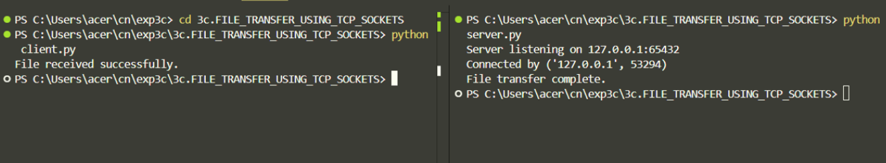

# 3c.CREATION FOR FILE TRANSFER USING TCP SOCKETS
## AIM
To write a python program for creating File Transfer using TCP Sockets Links
## ALGORITHM:
1. Import the necessary python modules.
2. Create a socket connection using socket module.
3. Send the message to write into the file to the client file.
4. Open the file and then send it to the client in byte format.
5. In the client side receive the file from server and then write the content into it.
## PROGRAM
```
CLIENT.py

import socket

def receive_file(output_filename, host='127.0.0.1', port=65432):
    client_socket = socket.socket(socket.AF_INET, socket.SOCK_STREAM)
    client_socket.connect((host, port))

    with open(output_filename, 'wb') as f:
        while True:
            data = client_socket.recv(1024)
            if not data:
                break
            f.write(data)

    print("File received successfully.")
    client_socket.close()

if __name__ == "__main__":
    receive_file("received_sample.txt")   # File will be saved here


SERVER.py

import socket

def send_file(filename, host='127.0.0.1', port=65432):
    # Create TCP socket
    server_socket = socket.socket(socket.AF_INET, socket.SOCK_STREAM)
    server_socket.bind((host, port))
    server_socket.listen(1)
    print(f"Server listening on {host}:{port}")

    conn, addr = server_socket.accept()
    print(f"Connected by {addr}")

    # Open file and send in chunks
    with open(filename, 'rb') as f:
        data = f.read(1024)
        while data:
            conn.send(data)
            data = f.read(1024)

    print("File transfer complete.")
    conn.close()
    server_socket.close()

if __name__ == "__main__":
    send_file("sample.txt")   # Replace with the file you want to send


```
## OUPUT

## RESULT
Thus, the python program for creating File Transfer using TCP Sockets Links was 
successfully created and executed.
